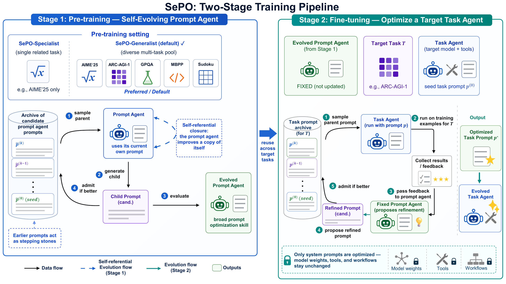

<h1 align="center">SePO: Self-Evolving Prompt Agent<br>for System Prompt Optimization</h1>

**SePO** is a self-evolving system prompt optimization framework that improves a prompt agent by applying the same prompt optimization procedure to the prompt agent itself.

SePO starts from a simple observation: existing system prompt optimization methods usually keep the prompt agent hand-engineered and fixed. SePO closes this loop by treating the prompt agent's own system prompt as an optimization target, enabling the prompt agent to improve itself during pre-training and then reuse the evolved prompt optimization skill during task-specific fine-tuning.

## Pipeline

The overall two-stage training pipeline is shown below:



During **pre-training**, SePO evolves the prompt agent's own system prompt over a task pool. During **fine-tuning**, the evolved prompt agent is reused to optimize task agents' system prompts for various tasks.

## Status

Code release preparation is in progress.

## Citation

If you find SePO useful, please cite:

```bibtex
@article{tao2026sepo,
  title   = {SePO: Self-Evolving Prompt Agent for System Prompt Optimization},
  author  = {Tao, Wangcheng and Wu, Han and Wong, Weng-Fai},
  journal = {arXiv preprint arXiv:2606.04465},
  year    = {2026}
}
```
